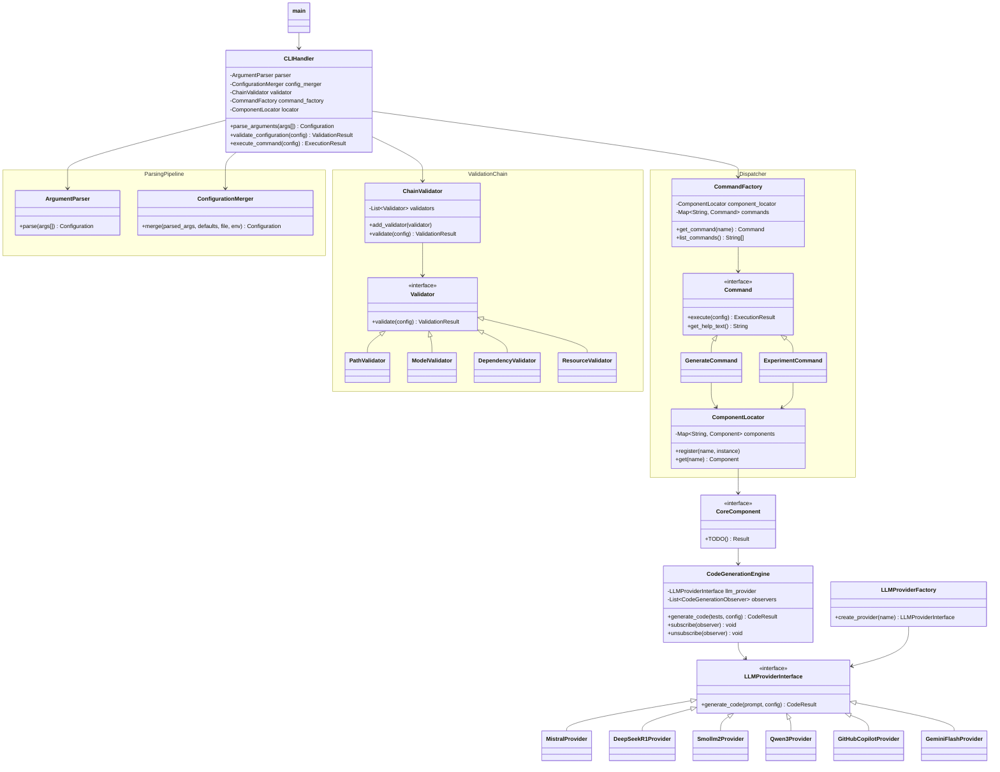

# Project Class Diagram

```mermaid
classDiagram

    class main {}

    class CLIHandler {
        -ArgumentParser parser
        -ConfigurationMerger config_merger
        -ChainValidator validator
        -CommandFactory command_factory
        -ComponentLocator locator
        +parse_arguments(args[]) Configuration
        +validate_configuration(config) ValidationResult
        +execute_command(config) ExecutionResult
    }
    
    namespace ParsingPipeline {
        class ArgumentParser {
            +parse(args[]) Configuration
        }

        class ConfigurationMerger {
            +merge(parsed_args, defaults, file, env) Configuration
        }
    }
    
    namespace ValidationChain {    
        class ChainValidator {
            -List~Validator~ validators
            +add_validator(validator)
            +validate(config) ValidationResult
        }

        class Validator {
            <<interface>>
            +validate(config) ValidationResult
        }

        class PathValidator {}
        class ModelValidator {}
        class DependencyValidator {}
        class ResourceValidator {}
    }
    
    namespace Dispatcher {

        class CommandFactory {
            -ComponentLocator component_locator
            -Map~String, Command~ commands
            +get_command(name) Command
            +list_commands() String[]
        }
        
        class Command {
            <<interface>>
            +execute(config) ExecutionResult
            +get_help_text() String
        }
        
        class GenerateCommand {}
        
        class ExperimentCommand {}

        class ComponentLocator {
            -Map~String, Component~ components
            +register(name, instance)
            +get(name) Component
        }
    }

    class CoreComponent {
        <<interface>>
        +TODO() Result
    }

    class CodeGenerationEngine {
        -LLMProviderInterface llm_provider
        -List~CodeGenerationObserver~ observers
        +generate_code(tests, config) CodeResult
        +subscribe(observer) void
        +unsubscribe(observer) void
    }
    class LLMProviderInterface {
        <<interface>>
        +generate_code(prompt, config) CodeResult
    }
    class LLMProviderFactory {
        +create_provider(name) LLMProviderInterface
    }
    CoreComponent --> CodeGenerationEngine
    CodeGenerationEngine --> LLMProviderInterface
    LLMProviderFactory --> LLMProviderInterface
    LLMProviderInterface <|-- MistralProvider
    LLMProviderInterface <|-- DeepSeekR1Provider
    LLMProviderInterface <|-- Smollm2Provider
    LLMProviderInterface <|-- Qwen3Provider
    LLMProviderInterface <|-- GitHubCopilotProvider
    LLMProviderInterface <|-- GeminiFlashProvider
    main --> CLIHandler
    CLIHandler --> CommandFactory
    CommandFactory --> Command
    Command <|-- GenerateCommand
    Command <|-- ExperimentCommand
    ChainValidator --> Validator
    Validator <|-- PathValidator
    Validator <|-- ModelValidator
    Validator <|-- DependencyValidator
    Validator <|-- ResourceValidator
    CLIHandler --> ChainValidator
    CLIHandler --> ArgumentParser
    CLIHandler --> ConfigurationMerger
    GenerateCommand --> ComponentLocator
    ExperimentCommand --> ComponentLocator
    ComponentLocator --> CoreComponent
```
