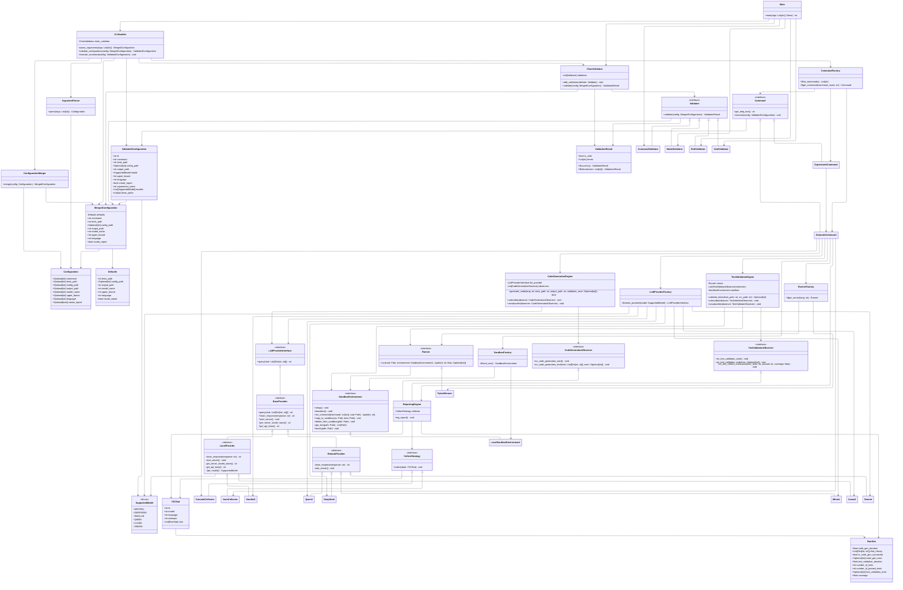

# Project Class Diagram

```mermaid
---
config:
    layout: elk
    class:
      hideEmptyMembersBox: true
---

classDiagram

    %% CLI

    class Main {
        +main(args: List[str] | None) int
    }

    class CLIHandler {
        -ChainValidator chain_validator
        +parse_arguments(args: List[str]) MergedConfiguration
        +validate_configuration(config: MergedConfiguration) ValidatedConfiguration
        +execute_command(config: ValidatedConfiguration) void
    }

    class ChainValidator {
        -List[Validator] validators
        +add_validator(validator: Validator) void
        +validate(config: MergedConfiguration) ValidationResult
    }

    class ArgumentParser {
        +parse(args: List[str]) Configuration
    }

    class Configuration {
        +Optional[str] command
        +Optional[str] tests_path
        +Optional[str] config_path
        +Optional[str] output_path
        +Optional[str] model_name
        +Optional[int] upper_bound
        +Optional[str] language
        +Optional[bool] create_report
    }

    class ConfigurationMerger {
        +merge(config: Configuration) MergedConfiguration
    }

    class MergedConfiguration {
        -Defaults defaults
        +str command
        +str tests_path
        +Optional[str] config_path
        +str output_path
        +str model_name
        +int upper_bound
        +str language
        +bool create_report
    }

    class Defaults {
        +str tests_path
        +Optional[str] config_path
        +str output_path
        +str model_name
        +int upper_bound
        +str language
        +bool create_report
    }

    class ValidatedConfiguration {
        +str id
        +str command
        +str tests_path
        +Optional[str] config_path
        +str output_path
        +SupportedModel model
        +int upper_bound
        +str language
        +bool create_report
        +str experiment_name
        +List[SupportedModel] models
        +List[str] tests_paths
    }

    class Validator {
        <<interface>>
        +validate(config: MergedConfiguration) ValidationResult
    }

    class ValidationResult {
        +bool is_valid
        +List[str] errors
        +$success() ValidationResult
        +$failure(errors: List[str]) ValidationResult
    }

    %% Dispatcher

    class CommandFactory {
        +$list_commands() List[str]
        +$get_command(command_name: str) Command
    }

    class Command {
        <<interface>>
        +get_help_text() str
        +execute(config: ValidatedConfiguration) void
    }

    %% Core

    class SupportedModel {
        <<Enum>>
        +MISTRAL
        +DEEPSEEK
        +SMOLLM
        +QWEN
        +LLAMA
        +GEMINI
    }

    class CodeGenerationEngine {
        -LLMProviderInterface llm_provider
        -List[CodeGenerationObserver] observers
        +generate_code(lang: str, tests_path: str, output_path: str, validation_error: Optional[str]) bool
        +subscribe(observer: CodeGenerationObserver) void
        +unsubscribe(observer: CodeGenerationObserver) void
    }

    class LLMProviderInterface {
        <<interface>>
        +query(chat: List[Dict[str, str]]) str
    }

    class BaseProvider {
        <<abstract>>
        +query(chat: List[Dict[str, str]]) str
        -*clean_response(response: str) str*
        -*start_server() void*
        -*get_server_model_name() str*
        -*get_api_base() str*
    }

    class LocalProvider {
        <<abstract>>
        -clean_response(response: str) str
        -start_server() void
        -get_server_model_name() str
        -get_api_base() str
        -*get_model() SupportedModel*
    }

    class RemoteProvider {
        <<abstract>>
        -clean_response(response: str) str
        -start_server() void
    }

    class LLMProviderFactory {
        +$create_provider(model: SupportedModel) LLMProviderInterface
    }

    class TestValidationEngine {
        -Runner runner
        -List[TestValidatorObserver] observers
        -SandboxEnvironment sandbox
        +validate_tests(tests_path: str, src_path: str) Optional[str]
        +subscribe(observer: TestValidatorObserver) void
        +unsubscribe(observer: TestValidatorObserver) void
    }

    class Runner {
        <<interface>>
        +run(cwd: Path, environment: SandboxEnvironment) tuple[int, int, float, Optional[str]]
    }

    class RunnerFactory {
        +$get_runner(lang: str) Runner
    }

    class SandboxFactory {
        +$local_env() SandboxEnvironment
    }

    class SandboxEnvironment {
        <<interface>>
        +setup() void
        +teardown() void
        +run_command(command: List[str], cwd: Path) tuple[int, str]
        +copy_to_sandbox(src: Path, dest: Path) void
        +delete_from_sandbox(path: Path) void
        +get_dirs(path: Path) List[Path]
        +touch(path: Path) void
    }

    class ReportingEngine {
        -CollectStrategy collector
        +log_report() void
    }

    class CollectStrategy {
        <<interface>>
        +collect(data: T2CStat) void
    }

    class CodeGenerationObserver {
        <<interface>>
        +on_code_generation_start() void
        +on_code_generation_end(chat: List[Dict[str, str]], error: Optional[str]) void
    }

    class TestValidationObserver {
        <<interface>>
        +on_test_validation_start() void
        +on_test_validation_end(error: Optional[str]) void
        +on_test_metrics_measured(num_tests: int, passed: int, coverage: float) void
    }

    class T2CStat {
        +str id
        +str model
        +str language
        +str attempts
        +List[RunStat] runs
    }

    class RunStat {
        +float code_gen_duration
        +List[Dict[str, str]] chat_history
        +bool is_code_gen_successful
        +Optional[str] code_gen_error
        +float test_validation_duration
        +int number_of_tests
        +int number_of_passed_tests
        +Optional[str] test_validation_error
        +float coverage
    }

    Main --> CLIHandler
    Main --> ChainValidator
    Main --> CommandValidator
    Main --> ModelValidator
    Main --> PathValidator
    Main --> YamlValidator
    ChainValidator --> MergedConfiguration
    ChainValidator --> ValidationResult
    ChainValidator --> Validator
    CLIHandler --> ArgumentParser
    CLIHandler --> ConfigurationMerger
    CLIHandler --> MergedConfiguration
    CLIHandler --> ChainValidator
    CLIHandler --> ValidatedConfiguration
    CLIHandler --> CommandFactory
    ArgumentParser --> Configuration
    ConfigurationMerger --> Configuration
    ConfigurationMerger --> MergedConfiguration
    MergedConfiguration --> Defaults
    MergedConfiguration --> Configuration
    ValidatedConfiguration --> MergedConfiguration
    ValidatedConfiguration --> SupportedModel
    Validator --> ValidationResult
    Validator --> MergedConfiguration
    Validator <|-- CommandValidator
    Validator <|-- ModelValidator
    Validator <|-- PathValidator
    Validator <|-- YamlValidator

    CommandFactory --> Command
    CommandFactory --> GenerateCommand
    CommandFactory --> ExperimentCommand
    Command <|-- GenerateCommand
    Command <|-- ExperimentCommand
    Command --> ValidatedConfiguration
    ExperimentCommand --> GenerateCommand
    GenerateCommand --> CodeGenerationEngine
    GenerateCommand --> LLMProviderFactory
    GenerateCommand --> ConsoleCollector
    GenerateCommand --> JsonCollector
    GenerateCommand --> ReportingEngine
    GenerateCommand --> TestValidationEngine
    GenerateCommand --> RunnerFactory
    GenerateCommand --> SandboxFactory

    CodeGenerationEngine --> LLMProviderInterface
    CodeGenerationEngine --> CodeGenerationObserver
    LLMProviderFactory --> SupportedModel
    LLMProviderFactory --> LLMProviderInterface
    LLMProviderFactory --> Smollm2
    LLMProviderFactory --> Qwen3
    LLMProviderFactory --> DeepSeek
    LLMProviderFactory --> Mistral
    LLMProviderFactory --> Llama3
    LLMProviderFactory --> Gemini
    LLMProviderInterface <|-- BaseProvider
    BaseProvider <|-- LocalProvider
    BaseProvider <|-- RemoteProvider
    LocalProvider <|-- Smollm2
    LocalProvider <|-- Llama3
    LocalProvider --> SupportedModel
    RemoteProvider <|-- Qwen3
    RemoteProvider <|-- DeepSeek
    RemoteProvider <|-- Mistral
    RemoteProvider <|-- Gemini
    TestValidationEngine --> TestValidationObserver
    TestValidationEngine --> Runner
    TestValidationEngine --> SandboxEnvironment
    Runner --> SandboxEnvironment
    SandboxFactory --> SandboxEnvironment
    SandboxFactory --> LocalSandboxEnvironment
    RunnerFactory --> Runner
    RunnerFactory --> PytestRunner
    Runner <|-- PytestRunner
    SandboxEnvironment <|-- LocalSandboxEnvironment
    ReportingEngine --> CollectStrategy
    ReportingEngine --> RunStat
    ReportingEngine --> T2CStat
    CodeGenerationObserver <|-- ReportingEngine
    TestValidationObserver <|-- ReportingEngine
    CollectStrategy <|-- ConsoleCollector
    CollectStrategy <|-- JsonCollector
    CollectStrategy --> T2CStat
    T2CStat --> RunStat
```
