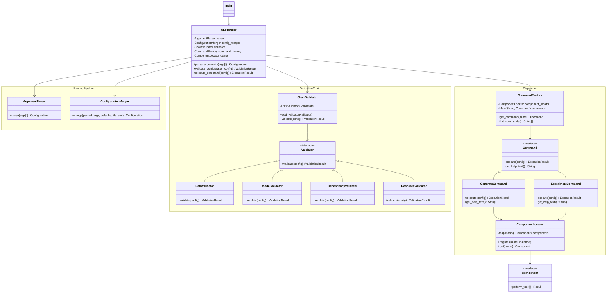

# Project Class Diagram

```mermaid
classDiagram

    class main {}

    class CLIHandler {
        -ArgumentParser parser
        -ConfigurationMerger config_merger
        -ChainValidator validator
        -CommandFactory command_factory
        -ComponentLocator locator
        +parse_arguments(args[]) Configuration
        +validate_configuration(config) ValidationResult
        +execute_command(config) ExecutionResult
    }
    
    namespace ParsingPipeline {
        class ArgumentParser {
            +parse(args[]) Configuration
        }

        class ConfigurationMerger {
            +merge(parsed_args, defaults, file, env) Configuration
        }
    }
    
    namespace ValidationChain {    
        class ChainValidator {
            -List~Validator~ validators
            +add_validator(validator)
            +validate(config) ValidationResult
        }

        class Validator {
            <<interface>>
            +validate(config) ValidationResult
        }

        class PathValidator {
            +validate(config) ValidationResult
        }
        class ModelValidator {
            +validate(config) ValidationResult
        }
        class DependencyValidator {
            +validate(config) ValidationResult
        }
        class ResourceValidator {
            +validate(config) ValidationResult
        }
    }
    
    namespace Dispatcher {

        class CommandFactory {
            -ComponentLocator component_locator
            -Map~String, Command~ commands
            +get_command(name) Command
            +list_commands() String[]
        }
        
        class Command {
            <<interface>>
            +execute(config) ExecutionResult
            +get_help_text() String
        }
        
        class GenerateCommand {
            +execute(config) ExecutionResult
            +get_help_text() String
        }
        
        class ExperimentCommand {
            +execute(config) ExecutionResult
            +get_help_text() String
        }

        class ComponentLocator {
            -Map~String, Component~ components
            +register(name, instance)
            +get(name) Component
        }
    }

    class Component {
        <<interface>>
        +perform_task() Result
    }

    main --> CLIHandler
    CLIHandler --> CommandFactory
    CommandFactory --> Command
    Command <|-- GenerateCommand
    Command <|-- ExperimentCommand
    ChainValidator --> Validator
    Validator <|-- PathValidator
    Validator <|-- ModelValidator
    Validator <|-- DependencyValidator
    Validator <|-- ResourceValidator
    CLIHandler --> ChainValidator
    CLIHandler --> ArgumentParser
    CLIHandler --> ConfigurationMerger
    GenerateCommand --> ComponentLocator
    ExperimentCommand --> ComponentLocator
    ComponentLocator --> Component
```
