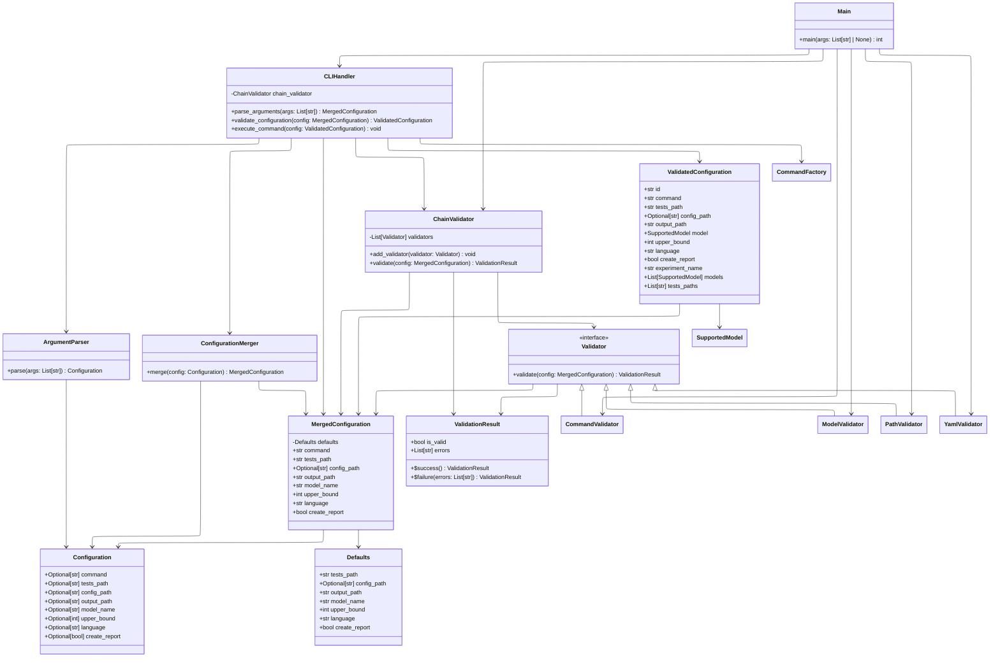

# Project Class Diagram

```mermaid
---
config:
    layout: elk
    class:
      hideEmptyMembersBox: true
---

classDiagram
    class Main {
        +main(args: List[str] | None) int
    }

    class CLIHandler {
        -ChainValidator chain_validator
        +parse_arguments(args: List[str]) MergedConfiguration
        +validate_configuration(config: MergedConfiguration) ValidatedConfiguration
        +execute_command(config: ValidatedConfiguration) void
    }

    class ChainValidator {
        -List[Validator] validators
        +add_validator(validator: Validator) void
        +validate(config: MergedConfiguration) ValidationResult
    }

    class ArgumentParser {
        +parse(args: List[str]) Configuration
    }

    class Configuration {
        +Optional[str] command
        +Optional[str] tests_path
        +Optional[str] config_path
        +Optional[str] output_path
        +Optional[str] model_name
        +Optional[int] upper_bound
        +Optional[str] language
        +Optional[bool] create_report
    }

    class ConfigurationMerger {
        +merge(config: Configuration) MergedConfiguration
    }

    class MergedConfiguration {
        -Defaults defaults
        +str command
        +str tests_path
        +Optional[str] config_path
        +str output_path
        +str model_name
        +int upper_bound
        +str language
        +bool create_report
    }

    class Defaults {
        +str tests_path
        +Optional[str] config_path
        +str output_path
        +str model_name
        +int upper_bound
        +str language
        +bool create_report
    }

    class ValidatedConfiguration {
        +str id
        +str command
        +str tests_path
        +Optional[str] config_path
        +str output_path
        +SupportedModel model
        +int upper_bound
        +str language
        +bool create_report
        +str experiment_name
        +List[SupportedModel] models
        +List[str] tests_paths
    }

    class Validator {
        <<interface>>
        +validate(config: MergedConfiguration) ValidationResult
    }

    class ValidationResult {
        +bool is_valid
        +List[str] errors
        +$success() ValidationResult
        +$failure(errors: List[str]) ValidationResult
    }

    Main --> CLIHandler
    Main --> ChainValidator
    Main --> CommandValidator
    Main --> ModelValidator
    Main --> PathValidator
    Main --> YamlValidator
    ChainValidator --> MergedConfiguration
    ChainValidator --> ValidationResult
    ChainValidator --> Validator
    CLIHandler --> ArgumentParser
    CLIHandler --> ConfigurationMerger
    CLIHandler --> MergedConfiguration
    CLIHandler --> ChainValidator
    CLIHandler --> ValidatedConfiguration
    CLIHandler --> CommandFactory
    ArgumentParser --> Configuration
    ConfigurationMerger --> Configuration
    ConfigurationMerger --> MergedConfiguration
    MergedConfiguration --> Defaults
    MergedConfiguration --> Configuration
    ValidatedConfiguration --> MergedConfiguration
    ValidatedConfiguration --> SupportedModel
    Validator --> ValidationResult
    Validator --> MergedConfiguration
    Validator <|-- CommandValidator
    Validator <|-- ModelValidator
    Validator <|-- PathValidator
    Validator <|-- YamlValidator
```
