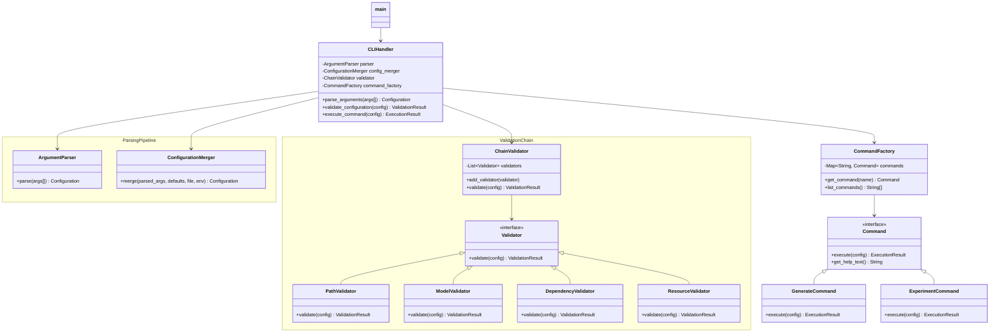

# Project Class Diagram

```mermaid
classDiagram

    class main {}

    class CLIHandler {
        -ArgumentParser parser
        -ConfigurationMerger config_merger
        -ChainValidator validator
        -CommandFactory command_factory
        +parse_arguments(args[]) Configuration
        +validate_configuration(config) ValidationResult
        +execute_command(config) ExecutionResult
    }
    
    namespace ParsingPipeline {
        class ArgumentParser {
            +parse(args[]) Configuration
        }

        class ConfigurationMerger {
            +merge(parsed_args, defaults, file, env) Configuration
        }
    }
    
    namespace ValidationChain {    
        class ChainValidator {
            -List~Validator~ validators
            +add_validator(validator)
            +validate(config) ValidationResult
        }

        class Validator {
            <<interface>>
            +validate(config) ValidationResult
        }

        class PathValidator {
            +validate(config) ValidationResult
        }
        class ModelValidator {
            +validate(config) ValidationResult
        }
        class DependencyValidator {
            +validate(config) ValidationResult
        }
        class ResourceValidator {
            +validate(config) ValidationResult
        }
    }
    
    class CommandFactory {
        -Map~String, Command~ commands
        +get_command(name) Command
        +list_commands() String[]
    }
    
    class Command {
        <<interface>>
        +execute(config) ExecutionResult
        +get_help_text() String
    }
    
    class GenerateCommand {
        +execute(config) ExecutionResult
    }
    
    class ExperimentCommand {
        +execute(config) ExecutionResult
    }

    main --> CLIHandler
    CLIHandler --> CommandFactory
    CommandFactory --> Command
    Command <|-- GenerateCommand
    Command <|-- ExperimentCommand
    ChainValidator --> Validator
    Validator <|-- PathValidator
    Validator <|-- ModelValidator
    Validator <|-- DependencyValidator
    Validator <|-- ResourceValidator
    CLIHandler --> ChainValidator
    CLIHandler --> ArgumentParser
    CLIHandler --> ConfigurationMerger
```
