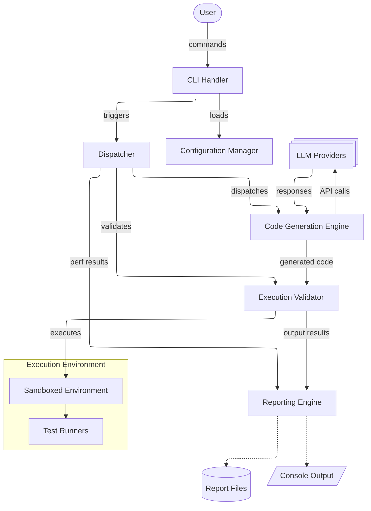

# Architecture

The system architecture consists of several key components that work together to achieve the goal of generating code from test specifications using Large Language Models (LLMs).

## Command Line Interface Helper

The front-end of the application faces directly to command line. This component is responsible of parsing the user input in order to launch the corresponding features in the later components.

It features 2 main commands: `generate` and `experiment`.

### Generate Command

The `generate` command is a one-shot command that performs a code generation with the specified configuration.

The command has been planned to be functional even with no configuration. The following is sufficient to let T2C do its job.

```bash
t2c generate
```

However it supports these configurations:

- `--tests`, `-t`: a path to the directory containing the test files;
- `--outout`, `-o`: a path to the directory that will contain the result;
- `--model`, `-m`: a string that describes what model to use;
- `--upperBound`, `-u`: the max number of tries the tool should do before returning a failure.

As said before, even no arguments could be passed. In that case the following values will be used:

- `--tests`: `.`;
- `--output`: `../result`;
- `--model`: `smollm2`;
- `--upperBound`: `3`.

### Experiment Command

The experiment command is the one that performs experiments over many different llms. Its main capability is to report into a file the results gained during the experiments.

It takes as input a `yml` file in which all the configurations are set.

```bash
t2c experiment --config experiments.yml
```

This is an comprehensive example of the file:

```yml
experiment:
  name: "T2C Comparative Study"
  output_dir: "./experiments/results"
  
models:
  - "mistral"
  - "smollm2"
  - "github-copilot"

test_suites:
  - name: "unit_tests"
    path: "./tests/unit"
    language: "python"
  - name: "integration_tests"
    path: "./tests/integration"
    language: "python"

strategies:
  prompt_engineering: ["zero_shot", "few_shot", "chain_of_thought"]
  max_retries: [1, 3, 5]
  matrix_testing: true # to combine multiple test suites in a single run
```

## Configuration Manager

This component is responsible of loading and validating the configuration file passed to the experiment command. It also provides default values for missing configurations.

## Dispatcher

The dispatcher orchestrates the workflow by coordinating interactions between the other components. It receives input from the CLI and ensures that each component performs its designated tasks in the correct sequence.

## Reporting Engine

It is responsible of handling the information gained from the code generation engine's runs. It features both dumping to console standard output and/or error and to a file.

It provides insights on the following metrics:

- generation success rates by model/strategy;
- performance metrics;
- token usage;
- error patterns.

## Code Generation Engine

It's the core of the application. It exploits an LLM to perform the code generation while dumping useful statistics during and at the end of the process. It is also responsible of handling retries.

## LLM Provider Interface

This component abstracts the interactions with various LLM providers, allowing the system to switch between different models seamlessly. It handles API calls, manages authentication, and processes responses from the LLMs.

## Execution Validator

It exploits a sandboxed environment to execute the generated code against the provided test suite.

## Architecture Diagram


