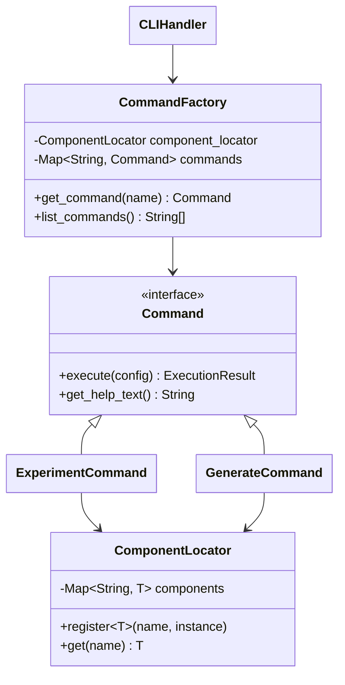
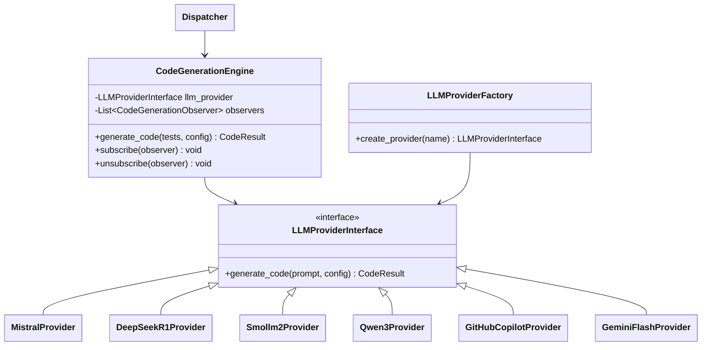
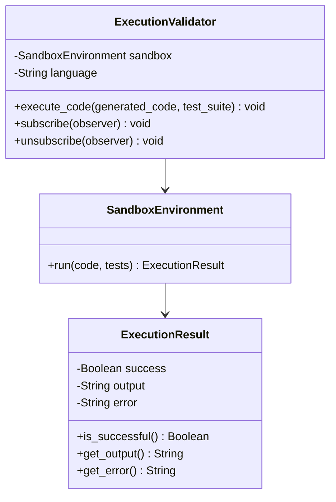
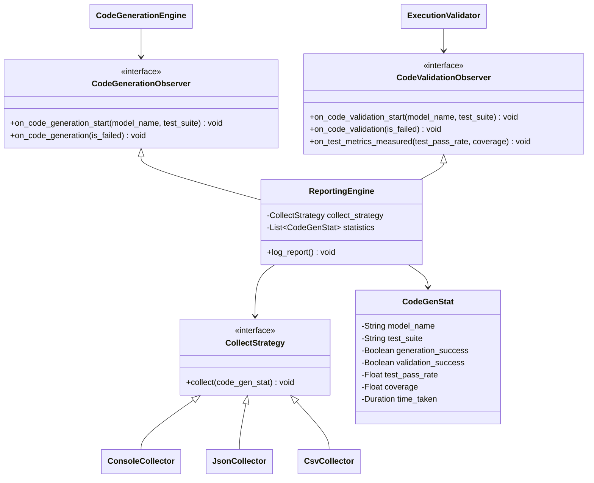

# Design

This section provides detailed design specifications for each component of the **Test 2 Code with LLMs (T2C)** system, focusing on internal structure, data flows, algorithms, and interfaces.

## CLI Handler

The CLI Handler implements a **Chain of Responsibility** for validation. It provides a clean separation between command parsing, validation, and execution delegation.

Since the execution logic is demanded to internal components, the CLI Handler focuses on argument parsing and validation. To achieve these functionalities, it employs two macro components:

- Parsing Pipeline;
- Validation Chain.

### Parsing Pipeline

To parse the command line arguments, 2 main steps are performed:

- Argument Parsing: to convert raw CLI input into structured data;
- Configuration Merging: to combine parsed arguments with defaults, config files, and environment variables.

### Validation Chain

The validation chain implements a series of validators that check different aspects of the configuration. Each validator can either pass the configuration to the next validator or return an error if validation fails.

The following validators are included:

- Command Validator: ensures the command is valid;
- Path Validator: checks if specified paths exist and are accessible;
- Model Validator: verifies if the specified LLM model is supported;
- Dependency Validator: ensures all required dependencies are installed;

### Final Class Diagram

### Detailed Processing Steps

## Dispatcher

The goal of the dispatcher is to delegate the execution of commands to the appropriate command handler based on user input. To do that, the dispatcher exploits the **Command Pattern** to encapsulate requests as objects and a **Service Locator** to retrieve later components' instances.

## Code Generation Engine

The Code Generation Engine is responsible for generating code based on provided test specifications using Large Language Models (LLMs). It exploits the **Strategy Pattern** to support multiple LLM providers and the **Factory Pattern** to instantiate the appropriate strategy based on user configuration.

## Execution Validator

The Execution Validator is responsible for executing the generated code against the provided test suite in a sandboxed environment. It ensures that the generated code meets the functional requirements specified by the tests.

## Experiment Manager

The logic for the experiment manager will already be included into the [`ExperimentCommand`](#dispatcher). Therefore no design is needed for this component.

## Reporting Engine

The Reporting Engine is responsible for actively collecting, tracking, and analyzing metrics throughout the code generation process. It implements the **Observer Pattern** to monitor events and the **Strategy Pattern** to construct comprehensive reports.

