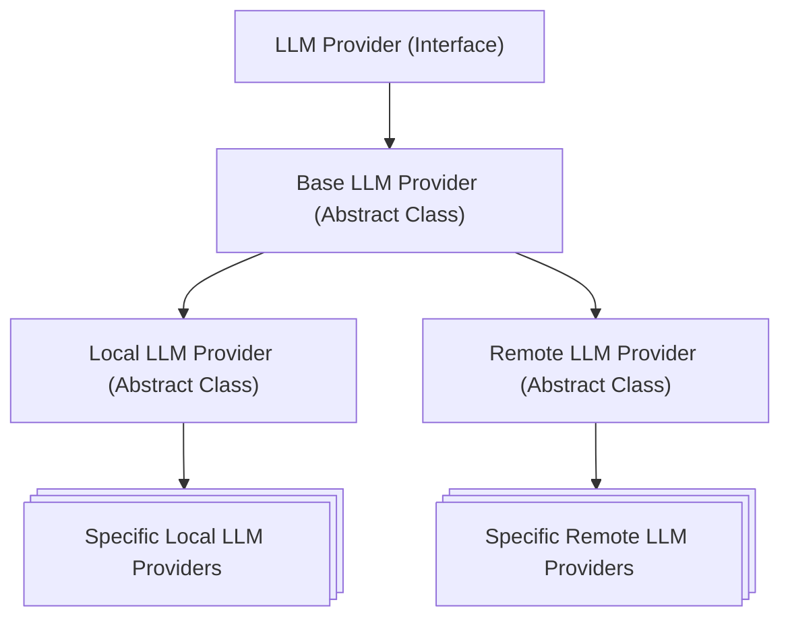

# Implementation

In this section, it has been described remarkable implementation details that are relevant to understand how the system works and how to interpret the results.

## Core Engines

Core engines are the following components:

- Test Validation Engine
- Code Generation Engine
- Reporting Engine

It is believed that, due to the core nature of these components, it should be applied some kind of [*creational pattern*](https://en.wikipedia.org/wiki/Creational_pattern) for their instantiation. It was firstly planned to use the *Service Locator* pattern, but since it is considered an anti-pattern by many, it was abandoned. It was also noted that the *Service Locator* would have been cumbersome since its instance should be passed around explicitly. Currently no pattern is applied, thus these components are instantiated directly where needed.

## LLM Provider(s)

The LLM Provider is the interface that let the code generation engine abstract from the specific LLM used. On top of this interface, it has been implemented 3 different abstract classes:

- Base LLM Provider
- Local LLM Provider
- Remote LLM Provider

The Base LLM Provider is the abstract class that implements the common logic for all LLM providers. It just implements the `LLMProvider.query()` method in which it exploits abstract methods to be implemented by the subclasses (i.e. the `Template Method Pattern`).
The Local LLM Provider is the abstract class for all LLM providers that run locally, i.e., on the same machine where the code generation engine runs. The Remote LLM Provider is the abstract class for all LLM providers that run remotely, i.e., on a different machine, and are accessed through a network connection.

### About adding new LLM Providers

To add a new LLM Provider, it is necessary to create a new class that implements the `LLMProvider` interface, or extends one of the abstract classes (`LocalLLMProvider` or `RemoteLLMProvider`), and implement the `query` method. The `query` method takes a string as input (the prompt) and returns a string as output (the LLM's response).

## Json Collector

The Json Collector is the component responsible for collecting the information related to the test validation and code generation processes, and storing them in a json file. Firstly it was thought to create a separate file for each process, having each file named after the run id. However, this approach would have created a lot of files. After a research it was found that having a single file is better for performance, since the number of files in a directory affects the performance of file system operations. Thus, the Json Collector has been changed to append the information to a single json file, in which each entry is identified by the run id.

## Case Studies

Even though the source code shall be generated from the LLMs, it has been necessary to implement the case studies to ensure that the relative tests actually pass. This section describes some implementation details of the case studies.

All case studies follow the same architectural pattern: Model-View-Controller (MVC). This choice has been made for 2 reasons:

1. It is a well known and established architectural pattern, which makes it easier to design the case studies and their tests.
2. For the same reason, it is easier for the LLMs to understand and generate code following this pattern.

Independently from the case study, the Model has been implemented as immutable, meaning that every time a change is made to the state of the Model, a new instance is created. Moreover, the View has had a minimal cli implementation, since there was no need for a more complex interface for the purpose of this work.

Despite the common architectural pattern, each case study has its own peculiarities, which are described in the following sections.

### Tic Tac Toe

This is the simplest case study. It has been implemented with a subtle break of the MVC pattern, where the Controller passes the Model directly to the View to render it.

This choice has been made to simplicity. Since the Model is immutable, there is no risk of the View modifying the Model.

Moreover, this case study has been implemented with the game loop **outside** of the Controller. This was quite a deliberate choice, to see what kind of code is more easy to test and easy to generate for the LLMs.

### Connect Four

This is the medium complexity case study. It has been implemented with the standard MVC pattern, where the Controller updates the Model, and the View is notified of the changes by the Controller (a.k.a. the Model-View-Presenter).

This case study has the game loop **outside** of the Controller, like Tic Tac Toe.

### 2048

This is the most complex case study. This is the only one that has the game loop **inside** of the Controller. This causes a bit more complexity in the tests, since the Controller has to be tested as a whole, instead of testing each cycle individually.

This case study also has a different directory structure. Instead of creating a separate directory for each component (Model, View, Controller), all the components are in the same directory. Since this was the last case study implemented, it was known that each component would be in a single file, thus this choice was made to reduce the number of directories.

---

It was created also a full project class diagram to better understand the relationships between the classes and their dependencies. The class diagram is available [in the appendices](./appendices/class-diagram.md)
