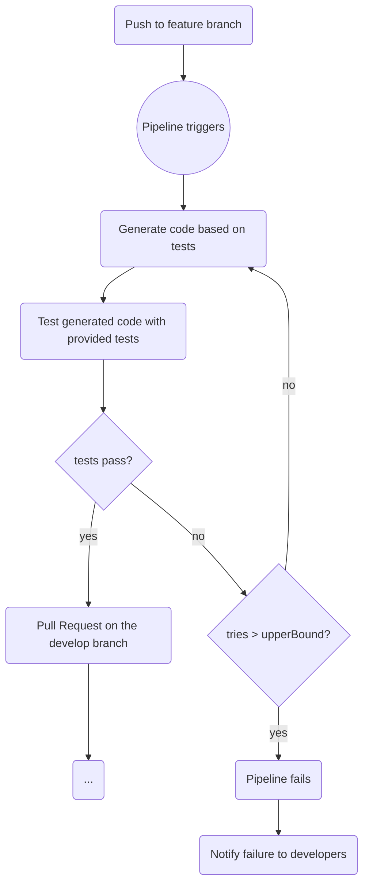

# Introduction

Test 2 Code with LLMs (T2C) is a project that explores the capabilities of Large Language Models (LLMs) in generating code from various types of tests, including Unit, Integration, and Acceptance tests. The idea is that, passing a directory that contains all the tests, T2C should be able to understand the context and generate code that satisfies the requirements defined by the tests. A usage example would be:

```bash
t2c generate --tests ./tests --output ./generated_code
```

where `./tests` is a directory containing the test files, and `./generated_code` is the directory where the generated code will be saved.

A possible application in case of a successful experiment could be the integration into the CI/CD pipelines. It would highly increase the productivity since the entire code generation is demanded to the LLM working on a remote machine, while the dev team can focus on how to engineer the next requirements into tests. The pipeline would look something like this:



## Project Objectives

The project aims to demonstrate how the role of a software developer can be shifted towards more of a test provider, with the LLM handling the code generation based on those tests. The project will pursuit its goal with two main approaches:

- research the best combination of test kinds to let the model succeed in code generation;
- create a pipeline infrastructure that could be exploited in case of a successful experiment.

The project will use case study of increased complexity like:

- Tic Tac Toe
- Snake
- Space Invaders

Moreover, experiments will be done among different models to find the sweet spot that maximizes the results. The following models will be used:

- Mistral
- DeepSeek R1
- Smollm2
- Qwen3
- Llama3
- Gemini Flash (until the API free tier limits)
